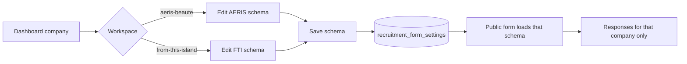
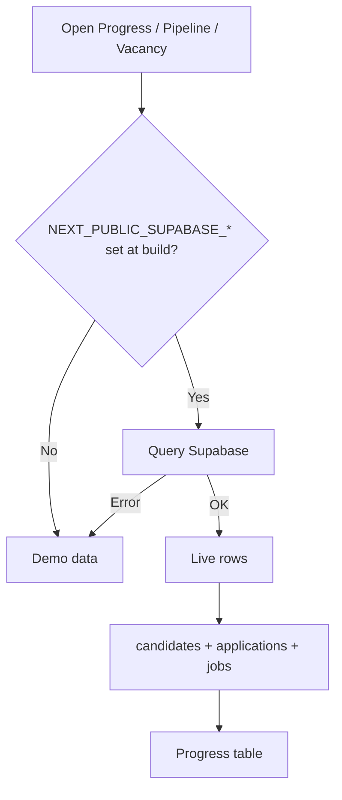

# HR Recruitment Dashboard

Internal recruitment tracker for **Aeris Beaute** and **From This Island**. One app, two brand workspaces — pipeline, progress, vacancies, emails, and hire requests stay separate per company.

**Production:** [https://hr-recruitment-aeris-fti.vercel.app/](https://hr-recruitment-aeris-fti.vercel.app/)

Stack: Next.js 16, React 19, Tailwind CSS v4, Framer Motion, optional Supabase, SMTP email.

## Brands

| Brand | Industry | Workspace |
| --- | --- | --- |
| Aeris Beaute | Beauty & Personal Care | `/aeris-beaute` |
| From This Island | Skincare & Beauty | `/from-this-island` |

The public hire request form also accepts **KIN** as a company. KIN has no dashboard workspace; its form schema and responses are stored separately.

## Pages

| Route | Screen |
| --- | --- |
| `/login` | Sign in (email/password, then Google) |
| `/` | Brand picker |
| `/[company]` | Overview |
| `/[company]/pipeline` | Kanban |
| `/[company]/candidates` | Progress tracker |
| `/[company]/jobs` | Vacancy tracker |
| `/[company]/emails` | Email templates (Interview, User Interview, Offering Letter) |
| `/[company]/settings` | Change password |
| `/[company]/request/form` | Customize the public request form |
| `/[company]/request/responses` | Submissions for that company |
| `/recruitment-request` | Public hire request (no login) |

`/[company]` is `aeris-beaute` or `from-this-island`.

## Flowcharts

### Sign in and workspace

```mermaid
flowchart TD
  A[Open app] --> B{Session cookie?}
  B -->|No| C[/login]
  C --> D{Sign in}
  D -->|Email + password| E[Verify hash]
  D -->|Google| F{Company domain?}
  F -->|No| C
  F -->|Yes| G[Set session]
  E -->|OK| G
  E -->|Fail| C
  B -->|Yes| H[/ brand picker]
  G --> H
  H --> I{Company}
  I -->|Aeris Beaute| J[/aeris-beaute]
  I -->|From This Island| K[/from-this-island]
  J --> L[Overview / Pipeline / Progress / Vacancy / Emails / Request / Settings]
  K --> L
```

### Public hire request

```mermaid
flowchart TD
  A[/recruitment-request] --> B[Pick company]
  B --> C{Company}
  C -->|AERIS| D[Load AERIS form schema]
  C -->|FTI| E[Load FTI form schema]
  C -->|KIN| F[Load KIN form schema]
  D --> G[Fill fields]
  E --> G
  F --> G
  G --> H[Pick Division]
  H --> I[Department options for that division]
  I --> J[Submit]
  J --> K[(recruitment_requests)]
```

### Admin request form and responses



### Candidate data



## Auth

Public routes: `/login`, `/api/auth/*`, `/recruitment-request`. Everything else needs a session.

Roles: **Admin** and **HR**.

- Google sign-in is limited to `@aerisbeaute.com` and `@fromthisisland.com`.
- Emails listed in `src/lib/auth/users.ts` keep that saved role.
- Any other allowed Google account starts as **HR**.

Seed admin (email + password):

```
email:    dwiki@aerisbeaute.com
password: aerisbeaute
role:     admin
```

Sessions use a signed httpOnly cookie (`AUTH_SECRET`).

### Settings — change password

`/[company]/settings` updates the password for **email sign-in**. Google sign-in is unchanged.

- Seed / email users must enter the current password, then a new one (min. 8 characters).
- Google-only accounts can set a password here so they can also sign in with email.
- New hashes are stored in Supabase table `hr_auth_passwords` (`supabase/auth-passwords.sql`). Run that SQL or the save will not persist on Vercel.

## Recruitment request

Public form at `/recruitment-request`. The requester picks a company first (AERIS, KIN, or FTI). That loads that company’s schema. Department options follow the selected Division.

In the dashboard, **Request → Form** edits the schema for the current workspace (AERIS or FTI). **Request → Responses** lists only that company’s submissions. Preview opens the public form in a new tab.

Without Supabase, schemas and responses stay in `localStorage`.

## Emails

Templates are per workspace: Interview, User Interview, Offering Letter. Merge fields: `{{candidate_name}}`, `{{role}}`, `{{company}}`. Send from a candidate record via SMTP (`POST /api/email/send`).

Gmail SMTP needs an app password. The `MAIL_FROM_ADDRESS` should match the authenticated mailbox, or Gmail may reject the send.

## Run locally

```bash
npm install
cp .env.example .env.local
npm run dev
```

Open [http://localhost:3000](http://localhost:3000). Restart after changing env files.

`.env.local` (local — do **not** set `AUTH_URL` here):

```
AUTH_SECRET=generate-a-long-random-string
GOOGLE_CLIENT_ID=
GOOGLE_CLIENT_SECRET=
NEXT_PUBLIC_SUPABASE_URL=
NEXT_PUBLIC_SUPABASE_ANON_KEY=
MAIL_HOST=smtp.gmail.com
MAIL_PORT=587
MAIL_USERNAME=
MAIL_PASSWORD=
MAIL_FROM_ADDRESS=
MAIL_FROM_NAME=HR Recruitment
```

Without Supabase keys, the app uses **demo data** for pipeline / progress / vacancy (Clara, Nadia, Sari, …). Request forms and email templates still work locally.

`NEXT_PUBLIC_SUPABASE_*` is baked in at **build** time. On Vercel, set both keys for Production, then **Redeploy**. Adding them later without a rebuild keeps prod on demo data even if Supabase already has new rows.

## Google OAuth — Cloud Console (step by step)

URI values must match exactly. No trailing slash.

### 1. Project

1. Open [Google Cloud Console](https://console.cloud.google.com/).
2. Top bar → project picker → **New project**.
3. Name: `HR Recruitment` → **Create**.
4. Select that project.

### 2. Consent screen

1. Open [Google Auth platform](https://console.cloud.google.com/auth/overview)
   (or **APIs & Services → OAuth consent screen**).
2. **Get started**.
3. App name: `HR Recruitment`.
4. User support email → **Next**.
5. Audience: **External** → **Next**.
   Use External; **Internal** only works for a single Google Workspace.
6. Contact email → **Next** → accept → **Create**.

### 3. Scopes

1. **Data Access**.
2. Keep:
   - `openid`
   - `userinfo.email`
   - `userinfo.profile`
3. **Add or remove scopes** → search `calendar` → add
   `https://www.googleapis.com/auth/calendar`.
4. **Save**.

### 4. Test users (required while status is Testing)

1. **Audience → Test users → Add users**.
2. Add company addresses that should log in (for example `dwiki@aerisbeaute.com`).
3. Until you **Publish app**, only those users can complete Google sign-in.

The app still rejects non-company domains after publish.

### 5. OAuth client

1. **Clients → Create client**
   (or **Credentials → Create credentials → OAuth client ID**).
2. Application type: **Web application**.
3. Name: `HR Dashboard`.
4. **Authorized JavaScript origins**:
   - `http://localhost:3000`
   - `https://hr-recruitment-aeris-fti.vercel.app`
5. **Authorized redirect URIs**:
   - `http://localhost:3000/api/auth/google/callback`
   - `https://hr-recruitment-aeris-fti.vercel.app/api/auth/google/callback`
6. **Create**.
7. Copy **Client ID** and **Client secret** into `.env.local` and Vercel.

`redirect_uri_mismatch` means a URI in Console does not match one of the two callback URLs above.

### 6. Google Calendar API

CalDAV is not used. Enable **Google Calendar API**:

1. [API Library → Google Calendar API](https://console.cloud.google.com/apis/library/calendar-json.googleapis.com)
2. **Enable**.
3. Supabase SQL Editor → run `supabase/google-calendar.sql`.
4. In the app, open that brand’s **Calendar → Connect Google Calendar** and allow access.

Each workspace has its own Connect / Disconnect. Progress dates for that brand go to a separate Google Calendar named `HR · Aeris Beaute` or `HR · From This Island` — the two brands are never mixed. Clearing a date in Progress removes the matching event. Disconnect keeps existing Google events.

If Calendar was connected before this change, **Disconnect** then **Connect** again so Google can create the brand calendar.

## Production (Vercel)

### Environment variables

Project → **Settings → Environment Variables** (Production):

```
AUTH_SECRET=long-random-string
AUTH_URL=https://hr-recruitment-aeris-fti.vercel.app
GOOGLE_CLIENT_ID=....apps.googleusercontent.com
GOOGLE_CLIENT_SECRET=....
NEXT_PUBLIC_SUPABASE_URL=...
NEXT_PUBLIC_SUPABASE_ANON_KEY=...
MAIL_HOST=smtp.gmail.com
MAIL_PORT=587
MAIL_USERNAME=...
MAIL_PASSWORD=...
MAIL_FROM_ADDRESS=...
MAIL_FROM_NAME=HR Recruitment
```

Redeploy after saving. `NEXT_PUBLIC_*` values are compiled into the client bundle — a new deployment is required after any change.

### Deployment Protection

If the prod URL shows a **Vercel** login instead of HR sign-in:

1. Vercel → project → **Settings → Deployment Protection**
2. Set **Vercel Authentication** to **Only Preview Deployments** (or Off)
3. Save

The app still gates access with its own login.

## Data (Supabase)

1. Create a project at [supabase.com](https://supabase.com).
2. SQL Editor → run in order:
   - `supabase/schema.sql` — companies, jobs, candidates
   - `supabase/migrate-tracker.sql` — if tables already exist from an older schema
   - `supabase/storage-cvs.sql` — CV upload bucket (`cvs`)
   - `supabase/recruitment-requests.sql` — request form schemas and submissions
   - `supabase/vacancy-settings.sql` — editable vacancy Level dropdown
   - `supabase/auth-passwords.sql` — password changes from Settings
   - `supabase/google-calendar.sql` — Google Calendar refresh tokens
3. Copy project URL and anon key into env.
4. Restart / redeploy.

Row Level Security in the schema is open for an internal MVP. Tighten it before a wider rollout.

If `recruitment_form_settings` was created as a single row (`id = 1`), re-run `supabase/recruitment-requests.sql` so schemas are stored per company (`AERIS`, `FTI`, `KIN`).

Without the `cvs` bucket, CV files still attach as an inline fallback.

## Scripts

```bash
npm run dev    # local development
npm run build  # production build
npm run start  # serve the build
npm run lint   # ESLint
```
